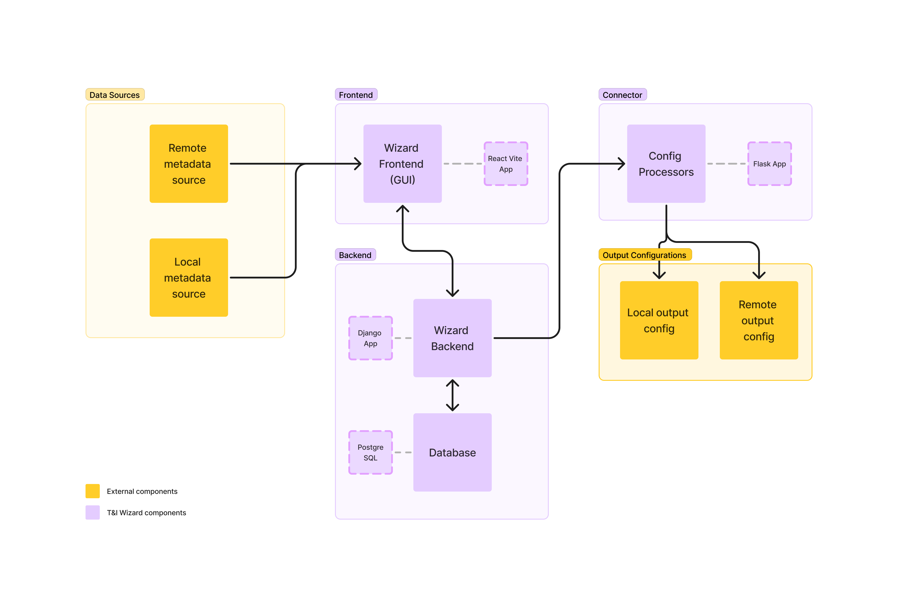

# Trust & Identity Wizard Connector

The Connector is a component of the Trust & Identity Wizard. This middleware application provides a
simpler way for identity management product administrators to configure and maintain their system.

Configuring of _Service Providers_ and _Identity Providers_
in [SAML](https://docs.oasis-open.org/security/saml/Post2.0/sstc-saml-tech-overview-2.0.html) or
Relying Parties and OpenID Providers
in [OIDC](https://openid.net/specs/openid-connect-core-1_0.html) can differ based on the chosen
technology stack. Identity products such
as [SATOSA](https://github.com/IdentityPython/SATOSA), [SimpleSAMLphp](https://simplesamlphp.org/)
or [Shibboleth](https://www.shibboleth.net/products/) require specific expertise to set up
technology stacks adhering to the same set of standards.

The underlying characteristics of OIDC and SAML standards should allow for automated creation of
product-specific configs based on a minimal necessary set of attributes. These attributes are
described by
the [Common Proxy Configuration Language (CPCL)](https://github.com/surfnet-niels/cpcl). This
process comprises several steps handled by the T&I Wizard:

**Frontend:**

- Extract the entity metadata from remote or local data sources
- Parse the metadata into the CPCL format

**Backend**

- Store the processed metadata
- Observe changes in the metadata and trigger notifications to the config processing component

**Connector**

- Process received metadata to transform them from CPCL to stack-specific configurations
- Version output configurations when changes occur

This repository contains the Connector component. The other components of the system can be found in
their respective git repositories:

- [T&I Wizard Frontend](https://github.com/alexarlord-boop/ti-wizard-gui)
- [T&I Wizard Backend](https://github.com/PeterBolha/ti-wizard-backend)

|  |
| :-----------------------------------------------------------: |
|                _Components of the T&I Wizard_                 |

## Architecture

Package `app_config_templates` contains the `config_processors_cfg.yaml` file which can be used to
configure the target technology stack, format and versioning of the processed config files. The
configuration options are described in the [Configuration](#Configuration) section.

Package `config_processors` contains the implementations of the individual config processors. A
config processor is a class extending the `ConfigProcessor` that implements the abstract
method `prepare_configuration`. This method takes the CPCL information from the input request and
creates a dictionary representing the output configuration of the target technology. An
example `CpclConfigProcessor` implementation is provided that produces a pure CPCL format output.
More information about the input and output of this method is provided in the section
on [Extending](#Extending) the project.

Package `config_version_managers` contains the versioning system. A version manager is a class
extending the `ConfigVersionManager` class that implements the abstract method `save_configuration`.
This method takes the target configuration prepared by the `prepare_configuration` method of a
config processor and stores it in the local file system or a Git repository based on the
configuration explained in the [Configuration](#Configuration) section.

Package `enums` contains enumeration types used throughout the application.

Package `tests` contains tests that can be run manually.

Package `utils` contains helper classes that are used for validation or internal configuration
throughout the component.

## Configuration

The entire component is configured in the `app_config_templates/config_processors_cfg.yaml` file.
The application config file comprises multiple sections:

The Connector is a Flask application that starts on `0.0.0.0:5000` by default. The host and port of
Flask the application can be set in the config:

```yaml
flask_settings:
  host: 0.0.0.0
  port: 5000`
```

The Connector receives the CPCL data in
a [django-webhook](https://django-webhook.readthedocs.io/en/latest/install.html#test-outgoing-webhooks)
received from the Wizard Backend. The data is signed by a key on the backend. In order for the
incoming request to be verified successfully, the `webhook_secret` needs to be configured and match
the `WEBHOOK_SECRET` value in `compose.yml` of
the [Wizard Backend](https://github.com/PeterBolha/ti-wizard-backend).

```yaml
shared_settings:
  webhook_secret: "secret"
```

The Connector can run an arbitrary number of config processors specified in
the `processor_specific_settings` section of the config. Following is an example of a configuration
with two config processors:

```yaml
satosa_yaml_processor:
  type: SATOSA
  version_manager:
    type: LOCAL
    config_folder_path: "/tmp/ti_wizard_configs"
    config_file_name: "cpcl_json_cfg"
    config_file_format: YAML

cpcl_git_json_processor:
  type: CPCL
  filters:
    - "b943ca408d3a2a4f13b9db8db10afe4c9bf0e323173f498ac188590b0843d8d9"
  version_manager:
    type: GIT
    git_repo: "https://github.com/username/configuration-repository.git"
    git_repo_folder_path: "/tmp/ti-wizard-cfg-versioning"
    git_branch_name: "configs"
    committer: "JohnDoe <johndoe@mail.com>"
    git_username: "JohnDoe"
    git_token: "git_access_token"
    config_file_name: "cpcl_json_cfg"
    config_file_format: JSON
```

`cpcl_json_processor` is the name of the processor. It must be at the beginning of each processor
configuration, but it does not affect any functionality. It solely serves to label the processor for
the user.

`type` defines the target technology stack of the produced configuration file. It determines the
config processor that will be used to produce the output from the CPCL in the received request. It
must be one of the values defined in `config_processor_type.py`.

`filters` is an optional field that specifies a list of `id_hash` values that the processor is
supposed to act upon. All the elements stored in the Wizard Backend (SPs, IdPs, OPs, RPs...) have a
unique identifier - `hash_id`. The filters allow the user to narrow down which entities is the
processor supposed to process. If the `filters` field is not provided, the processor will process
all the incoming requests.

`version_manager` is a required configuration element that specifies how the produced configuration
is to be stored. Elements of version manager configuration depend on its type.

`type` specifies how the output config file will be versioned. It must be one of the values defined
in `config_version_manager_type.py`.

- `LOCAL` files will be stored in the local file system
- `GIT` files will be stored in a Git repository

`config_file_format` specified the format of the output configuration file. It must be one of the
values defined in `config_file_format.py`.

|  |
| :-----------------------------------------------------------------------: |
|                    _Composition of a config processor_                    |

## Usage

1. Configure the application based on the [Configuration](#Configuration) section
2. Run the application in your IDE or from the command line using: `python app.py`

## Extending

The Connector can be extended by adding implementations in three main ways:

- config processors
- config version managers
- output file types

### Config Processors

- Add a new package in the `config_processors` package such as `new_processor`
- In the new package, implement your processor such as `NewProcessor(ConfigProcessor)` that creates
  a new configuration in the `prepare_configuration` method
- Add the new processor type to the `ConfigProcessorType` enum
- Extend the `get_processors` method in `ConfigProcessorsInitializer` to initialize the new
  processor from config in the same way as the other processor types, such as:

```python
match processor_type:
    case ConfigProcessorType.NEW_PROCESSOR_TYPE:
        configured_processors.append(
            NewConfigProcessor(processor_specific_config)
        )
```

### Version Managers

- Add a new config version manager class to the `config_version_managers` package that extends the
  `ConfigVersionManager` class or its children such
  as `NewConfigVersionManager(FileConfigVersionManager)`
  or `NewConfigVersionManager(ConfigVersionManager)`
- Implement the `save_configuration` method of `ConfigVersionManager`
- Add the new config version manager type to the `ConfigVersionManagerType` enum
- Extend the `get_config_version_manager` method in `ConfigVersionManagerInitializer` to initialize
  the new version manager in the same way as the other version manager types, such as:

```python
match version_manager_type:
    case ConfigVersionManagerType.NEW_VERSION_MANAGER_TYPE:
        return NewConfigVersionManager(self.__VERSION_MANAGER_CFG)
```

### File Types

- Add the new supported file type to the `ConfigFileFormat` enum
- Add the appropriate method in the `FileConfigVersionManager` to create your new file output
  similar to the other formats such as:

```python
def save_config_<


new_type > (self, config, file_path: str) -> str:
file_path += ".<new_type>"

# Perform necesssary actions for saving in the <new_type> format

return file_path
```

- Add the new file type to the `save_config_to_file` method in `FileConfigVersionManager` in the
  same way as the other file types such as:

```python
match output_format:
    case output_format.NEW_FORMAT_TYPE:
        return self.save_config_ < new_type > (config, file_path)
```

## Testing

There are three ways to test the new extensions to the Connector code:

- Add new tests to the `tests` package
  - Suitable for unit testing new helper components etc.
- Manually test a complex component
  - Suitable for new version managers and file types
  - Locally create a new file with a mock config input and config options that would be received
    from the `version_manager` section of the connector configuration
  - Execute the file content and observe results in the configured location
  - Example `GitConfigVersionManager` manual test:

```python
from config_version_managers.git_config_version_manager import

GitConfigVersionManager

version_manager_elements = {
    "git_repo": "https://github.com/User/config-versioning-repo.git",
    # local location of the repository
    "git_repo_folder_path": "/tmp/ti-wizard-cfg-versioning",
    "git_branch_name": "configs",
    "committer": "JohnDoe <johndoe@mail.com>",
    "git_username": "JohnDoe",
    "git_token": "token",
    "config_file_name": "cpcl_json_cfg",
    "config_file_format": "JSON",
}

mock_processed_config = {"entity_id": "my_entity_id", "specific_value": "123"}

version_manager = GitConfigVersionManager(version_manager_elements)
version_manager.save_configuration(mock_processed_config)

```

- Test full integration of a new component
  - Suitable for new config processor implementations
  - Implement and configure a new config processor as described in
    sections [Extending](#Extending) and [Configuration](#Configuration)
  - Run the Flask app and [send a request](#sending-the-webhook) to the `/remote-entity-update`
    endpoint
  - Observe the results expected from the new implementation and configuration

### Sending the webhook request

The webhook endpoint can be reached at `0.0.0.0:500/remote-entity-update` (using the default host
and port) and accepts POST requests. The content of the request is presumed to be a signed by
the `webhook_secret` key.

The content of the request from the backend will be
a [django-webhook](https://django-webhook.readthedocs.io/en/latest/install.html#test-outgoing-webhooks)
with the format:

```
POST HTTP/1.1
host: webhook.site
user-agent: python-urllib3/2.0.3
django-webhook-uuid: 5e2ee3ba-905e-4360-94bf-18ef21c0e844
django-webhook-signature-v1:
django-webhook-request-timestamp: 1697818014

{
  "topic": "remote_entities.RemoteEntity/update",
  "object": {
    "id": 1,
    "name": "example name",
    "description": "example desc",
    "entity_type": "SAML_SP",
    "entity_id": "test_entityid_3",
    "metadata_url": "https://change-example-metadata-url.com",
    "discovery_url": "",
    "client_id": "",
    "client_secret": "",
    "redirect_uri": "",
    "dynamic_registration": false,
    "id_hash": "b943ca408d3a2a4f13b9db8db10afe4c9bf0e323173f498ac188590b0843d8d9",
    "is_active": false,
    "comment": "",
    "metadata_hash": "some hash",
    "created_at": "2024-11-11T10:40:58.257653Z",
    "updated_at": "2024-12-06T20:04:18.121831Z",
    "created_by": 1,
    "updated_by": 2
  },
  "object_type": "remote_entities.RemoteEntity",
  "webhook_uuid": "5e2ee3ba-905e-4360-94bf-18ef21c0e844"
}
```

The Connector webhook expects the request to contain the `object` field with the data format as
shown in the example above. The remaining information is specific for the django library and not
relevant for the webhook.

## Testing integration with the backend

- Clone the [Wizard Backend](https://github.com/PeterBolha/ti-wizard-backend) repository
- Configure the shared secret, admin credentials etc. in `compose.yml`
- Run the container: `docker compose up --build`
- Authorize against the backend to gain an access token:
  - `POST http://0.0.0.0:8000/api/token/ {username: admin_username, password: admin_password}`
- Create a new entity (Use bearer token auth with the obtained token):
  - `POST http://0.0.0.0:8000/api/remote-entities/ {<CPCL attributes>}`
- Update the entity (Use bearer token auth with the obtained token)
  - `PUT http://0.0.0.0:8000/api/remote-entities/1/ {<changed CPCL attributes>}`
- Observe the webhook effects in the flask app
